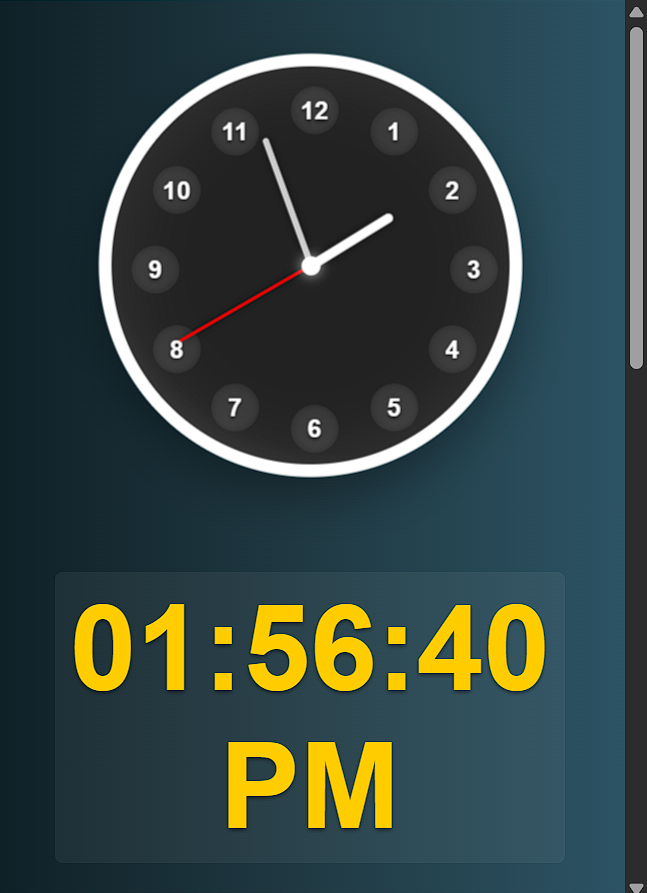

# 🕒 Analog Clock Extension

A modern, lightweight, and privacy-friendly analog clock for your All browser.  
Displays a real-time synchronized clock in a beautiful popup with timezone support.

---

## 🚀 Features

- ⏰ Real-time analog clock synced with system time
- 🌐 Option to show clocks for multiple countries (planned)
- 🔒 100% private — no data collection or tracking
- ⚙️ Simple privacy settings page
- 📦 Lightweight and offline-ready

---

## 📷 Screenshots

### 🕒 Clock Popup Preview  
[](image/Screenshot.png)  


---

## 🛠 Installation (Developer Mode)

1. Clone or [Download this repo as ZIP](https://github.com/adadarsh23/Date-and-Time-Extension-)
2. Go to `chrome://extensions/` in your Chrome browser
3. Enable **Developer Mode** (top-right toggle)
4. Click **“Load unpacked”** and select the extension folder
5. Click the clock icon in your Chrome toolbar to open the popup

---

## 🗂 Folder Structure

```bash

analog-clock-extension/
├── .gitignore
├── readme.md
├── assistManifest.json
├── manifest.json
├── welcome.html
├── popup.html
├── privacy.html
├── background.js
├── background.js.map
├── /icons
│ ├── icon16.png
│ ├── icon32.png
│ ├── icon48.png
│ └── icon128.png
└── /_locales
│ ├──  /en
│ ├────── messages.json
└── /font
│ ├──BitcountPropSingle_Cursive-Bold.ttf
├── /image
│ ├──Screenshot.png
├── /js
│ ├──popup.js
│ ├──popup.js.map
│ ├──count.js
│ ├──count.js.map
├── /style
│ ├──popup.css


```

---

## 📄 Privacy Policy

This extension does **not** collect, store, or transmit any user data.  
Everything runs locally in your browser.

See: [`privacy.html`](privacy.html) | [`welcome.html`](welcome.html)


---

## 🙋‍♂️ Author

**Ad Adarsh**  
💻 MERN Stack Developer & 🎧 Music Producer  
GitHub: [@adadarsh23](https://github.com/adadarsh23)  

---

## 🏷 License

MIT License © 2025 Ad Adarsh
