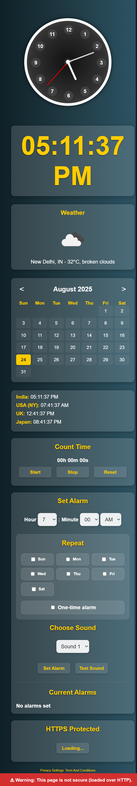

# 🕒 Analog Clock Extension

A modern, feature-rich analog clock extension for browsers with world time, calendar, alarms, and privacy protection.



---

## ✨ Features

### 🕐 Core Clock Features

- **Real-time Analog Clock**: Beautiful animated clock with smooth hand movements
- **Digital Time Display**: Current time shown below the analog clock
- **World Time Zones**: Live time for India, USA (NY), UK, and Japan
- **Calendar Integration**: Full monthly calendar with navigation
- **Weather Information**: Current weather display (when available)

### 🔔 Advanced Alarm System

- **Multiple Alarms**: Set and manage multiple alarms simultaneously
- **Custom Time Selection**: 12-hour format with AM/PM selection
- **Repeat Options**: Daily, weekly, or one-time alarms
- **Sound Selection**: Choose from multiple alarm sounds
- **Sound Testing**: Preview sounds before setting alarms
- **Smart Scheduling**: Automatic next-day scheduling for passed times

### ⏱ Timer & Countdown

- **Countdown Timer**: Start, stop, and reset functionality
- **Real-time Display**: Hours, minutes, and seconds format (00h 00m 00s)
- **Persistent Timing**: Continues counting until manually stopped
- **Easy Controls**: Simple Start/Stop/Reset buttons for quick access
- **Accurate Timing**: Precise second-by-second countdown display

### 🔒 Security & Privacy

- **HTTP/HTTPS Protection**: Built-in security warnings and protection for both HTTP and HTTPS sites
- **100% Private**: No data collection or external tracking
- **Local Storage**: All settings stored locally on your device
- **Offline Ready**: Works without internet connection
- **Security Monitoring**: Real-time detection of secure vs insecure connections

### 🎨 User Experience

- **Beautiful UI**: Modern gradient design with smooth animations
- **Responsive Design**: Works on all screen sizes
- **Custom Fonts**: Unique BitcountProp font for distinctive appearance
- **Easy Navigation**: Intuitive popup interface

---

## 🚀 Installation

### For Users

1. Download the extension files
2. Open your browser's extension management page
3. Enable Developer Mode
4. Click "Load unpacked" and select the extension folder
5. Click the clock icon in your toolbar to start using

### For Developers

```bash
# Clone the repository
git clone https://github.com/adadarsh23/Analog-Time
cd analog-clock-extension-1.2.0

# Install dependencies (if any)
npm install

# Build minified versions
Example with Terser:
Step 1
npm install terser -g
Step 2
terser js/popup.js --source-map "url='js/popup.js.map'" -o js/popup.min.js
```

---

## 📁 Project Structure

```
analog-clock-extension-1.2.0/
├── 📄 manifest.json              # Extension configuration
├── 📄 assistManifest.json        # Assistant manifest
├── 🌐 popup.html                 # Main popup interface
├── 🏠 welcome.html               # Welcome page
├── 🔒 privacy.html               # Privacy policy
├── 📋 term.html                  # Terms and conditions
├── ⚙️ background.js              # Background service worker
├── 🔧 httpscontent.js            # HTTPS content handling
├── 📁 js/                        # JavaScript modules
│   ├── popup.js                  # Main popup functionality
│   ├── alarm.js                  # Alarm system
│   ├── count.js                  # Countdown timer
│   ├── https.js                  # HTTPS protection
│   └── *.min.js                  # Minified versions
├── 🎨 style/
│   └── popup.css                 # Main stylesheet
├── 🔤 font/
│   └── BitcountPropSingle_Cursive-Bold.ttf
├── 🎵 sounds/
│   ├── sound1.mp3                # Alarm sound 1
│   └── sound2.mp3                # Alarm sound 2
├── 🖼️ icons/                     # Extension icons
├── 🌍 _locales/                  # Localization files
│   ├── en/                       # English
│   └── hi/                       # Hindi
└── 📸 image/
    └── Screenshot.png            # Extension preview
└── 🖼️ icons-img/                 # Feature icons and images
    ├── alarm-clock.png           # Alarm system icon
    ├── calendar.png              # Calendar feature icon
    ├── clock.png                 # Main clock icon
    ├── countdown.png             # Timer/countdown icon
    ├── cloudy-day.png            # Weather feature icon
    └── http.png                  # HTTP/HTTPS security icon
```

---

## 🎯 How to Use

### Setting Alarms

1. Open the extension popup
2. Navigate to "Set Alarm" section
3. Select hour, minute, and AM/PM
4. Choose repeat options (daily/weekly/one-time)
5. Select alarm sound
6. Click "Set Alarm" to schedule
7. Use "Test Sound" to preview

### Using the Countdown Timer

1. Go to "Count Time" section in the popup
2. Click "Start" to begin counting up from 00h 00m 00s
3. Use "Stop" to pause the timer at current count
4. Click "Reset" to return to 00h 00m 00s
5. Timer continues counting until manually stopped or reset

### Calendar Navigation

1. Use left/right arrows to navigate months
2. Current date is highlighted
3. View full month at a glance

---

## 🔧 Technical Details

- **Browser Support**: Chrome, Edge, Firefox (with manifest v3)
- **JavaScript**: ES6+ with minified production builds
- **CSS**: Modern CSS with gradients and animations
- **Fonts**: Custom BitcountProp font for unique styling
- **Storage**: Local browser storage for settings and alarms
- **Notifications**: Desktop notifications for alarm triggers

---

## 📱 Browser Compatibility

| Browser | Version | Status             |
| ------- | ------- | ------------------ |
| Chrome  | 88+     | ✅ Full Support    |
| Edge    | 88+     | ✅ Full Support    |
| Firefox | 109+    | ⚠️ Limited Support |

---

## 🔒 Privacy & Security

- **No Data Collection**: Extension operates entirely locally
- **HTTPS Protection**: Built-in security warnings
- **Local Storage**: All data stays on your device
- **No Tracking**: Zero external analytics or tracking
- **Open Source**: Transparent code for security review

---

## 📄 Legal

- [Privacy Policy](privacy.html) - How we handle your data
- [Terms & Conditions](term.html) - Usage terms and conditions
- [Welcome Page](welcome.html) - Getting started guide

---

## 🤝 Contributing

We welcome contributions! Please feel free to:

- Report bugs or issues
- Suggest new features
- Submit pull requests
- Improve documentation

---

## 👨‍💻 Author

**Ad Adarsh**  
🎯 MERN Stack Developer & 🎵 Music Producer  
📧 Email: adrajpu523@gmail.com  
🌐 GitHub: [@adadarsh23](https://github.com/adadarsh23)

---

## 📜 License

This project is licensed under the MIT License - see the [LICENSE](LICENSE.md) file for details.

---

## 🆕 Version History

### v1.2.0 (Current)

- ✅ Added Terms and Conditions page
- ✅ Enhanced HTTP/HTTPS protection and security monitoring
- ✅ Improved countdown timer with precise timing display
- ✅ Better script loading and organization
- ✅ Enhanced error handling and stability
- ✅ Added alarm system with multiple sounds
- ✅ Implemented countdown timer
- ✅ Added world time zones
- ✅ Calendar functionality

### v1.0.0

- ✅ Basic analog clock functionality
- ✅ Weather integration
- ✅ Privacy-focused design

---

## 📞 Support

Need help? Contact us:

- 📧 Email: adrajpu523@gmail.com
- 🐛 Report Issues: [GitHub Issues](https://github.com/adadarsh23/Analog-Time/issues)
- 📖 Documentation: Check the HTML files for detailed guides

---

<div align="center">

**Made with ❤️ by Ad Adarsh**

_Enjoy your new analog clock extension!_

</div>
